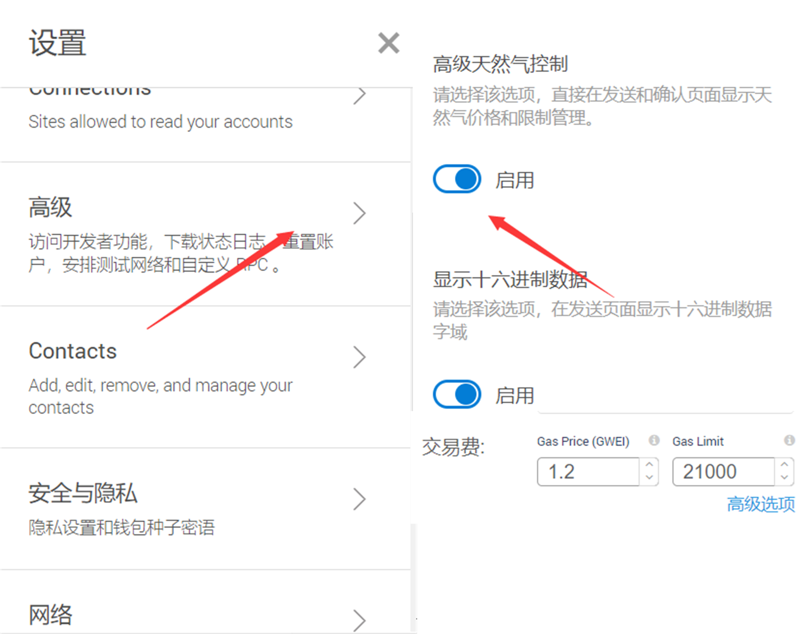

# CMAPP
基于以太坊Dapp的中医链
### 基本特性
* 上链信息无法篡改
* 采用web3交互模式
* 无需中心化数据库

### 使用方式
安装好metamask 谷歌浏览器插件，具体使用请见[metamask](https://metamask.io)官方网站。
本网站也提供metamask的crx包下载。或者访问[国内插件网站](https://chromecj.com/)
本站点采用node.js构建：
[网站链接](http://120.78.5.223:3000)
###### 基本功能：
* [用户注册](http://120.78.5.223:3000/index.html)
* [用户信息](http://120.78.5.223:3000/login.html)
* [病历上传](http://120.78.5.223:3000/form.html)
* [病历史查看](http://120.78.5.223:3000/table.html)
* [处方共享及查看](http://120.78.5.223:3000/index3.html)
* [药品生产、购买查询平台](http://120.78.5.223:3000/index6.html)

全程无监督，保证去中心化，合约部署链在
https://ropsten.infura.io/v3/bb74b607951d4e469dde2124c6320675 
chainID=3

##### 下面介绍如何使用Dapp:
推荐使用**google浏览器**
安好插件metamask（如果不会请[转这里](https://chromecj.com/utilities/2014-09/181.html)）\
首次使用注册账号（**请牢记密码**，重置需要密语，这意味着之前账户里的ETH可能将重置为0）\
配置网络：\

创建账户 Account\
您可以从“存入”栏中获取测试ETH。\
之后您就可以在网站上进行信息上传和加载操作了。\
**建议首次科学fq访问**，否则google的js会加载不出来
#### 如果交互失败怎么办？
请手动配置 gas 设置。\
每次交互时，需要一定的交易费：建议gas price 设置成1-10之间。
 

### 想成为管理员
请发邮件到 centurion-crawler@outlook.com
说明有关信息并附上证明，并发送您想申请管理员的账户地址。
```
版本：
Truffle v5.1.19 (core: 5.1.19)
Solidity v0.5.16 (solc-js)
Node v12.16.1
Web3.js v1.2.1
```